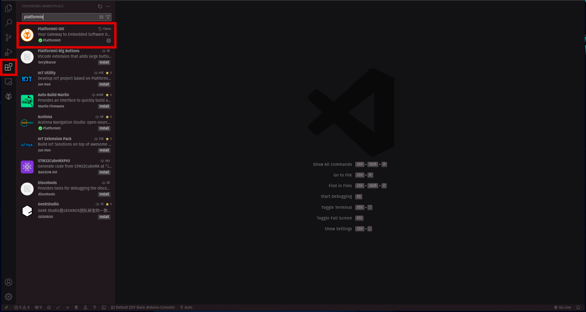
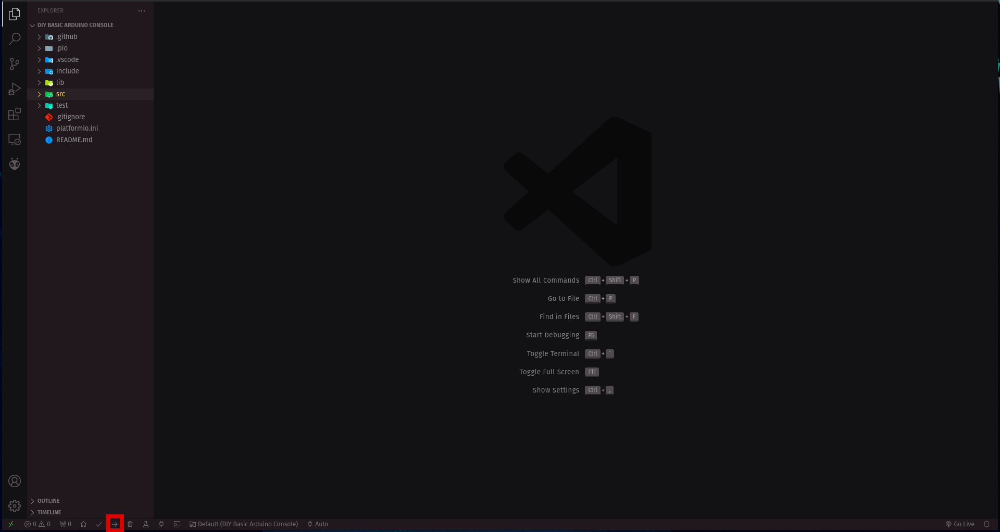

# DIY Basic Arduino Console
###### Version 1

Tested boards: **[Arduino Uno](https://www.amazon.es/Tarjeta-Microcontrolador-ATmega328P-ATMEGA16U2-Compatible/dp/B01M7ZB2B4/ref=sr_1_1_sspa?keywords=arduino+uno&qid=1673210929&sprefix=arduino%2Caps%2C120&sr=8-1-spons&sp_csd=d2lkZ2V0TmFtZT1zcF9hdGY&psc=1)**

Tested screens: **[LCD ST7920 128x64](https://www.amazon.es/ST7920-128x64-12864-Pantalla-retroiluminaci%C3%B3n/dp/B07Y4RFLZ5/ref=cm_cr_arp_d_pl_foot_top?ie=UTF8)**

## Getting started

1. Build the Arduino connections. See more in the **[Connections](#connections)** section.

1. Clone this project:
```sh
git clone https://github.com/morsoth/DIY-basic-arduino-console.git
```

2. Add Platform.​io extension to vscode:



3. Open this project from the Platform.​io extension:


4. Connect and upload the project to the Arduino.



5. Start playing with your DIY Arduino console!!!

## Connections


## Project structure

#### `src/main.cpp`
* Main project file.

#### `lib/Peripherals`
* Here are the header files for your peripherals. In this case `Button.h` and `Joystick.h` files already created. You can add more peripherals if your need.

#### `lib/Sprites/Sprites.h`
* Store your game sprites in this file. To learn how sprites work in this project go to **[How sprites work](#how-sprites-work)**.

#### `lib/Games`
* This folder contains the `Game.h` header file and for each game you create, the corresponding `.h` and `.cpp` files (_e.g. `SpaceInvaders.h` and `SpaceInvaders.cpp`_).

## How to create your own game

Let's see the steps you have to follow to create and run you own game:

1. Duplicate the `lib/Games/Demo.h` and `lib/Games/Demo.cpp` files.
2. Rename both files with the name of your game. For example want to a Tetris game we will rename both files to: `Tetris.h` and `Tetris.cpp`.
3. Modify the `Tetris.h` file:
```cpp
#ifndef TETRIS_H // <--
#define TETRIS_H // <--

...

class Tetris : public Game { // <--
...
};

#endif // TETRIS_H  <--
```
4. Include the `Tetris.h` file in `Tetris.cpp` : 
```cpp
#include "Tetris.h" // <--
...
```
5. Modify the `src/main.cpp` file:
```cpp
#include <Arduino.h>

#include "Tetris.h" // <--

Tetris tetris; // <--

void setup() {
    Serial.begin(115200);
    delay(10);

    tetris.setup(); // <--
}

void loop() {
    tetris.run(); // <--
}
```
6. Create your sprites in the `lib/Sprites/Sprites.h` file.
7. Start programming your game in the `Tetris.h` and `Tetris.cpp` files.


## How sprites work

To learn how sprites are drawn in this project lets first take a look at the `lib/Sprites/Sprites.h` file.

At the top of the file we can see this:
```cpp
...
#include "U8g2lib.h"

U8G2_ST7920_128X64_2_HW_SPI u8g2(U8G2_R0, /* CS=*/ 10, /* reset=*/ 8);
...
```
Those lines of code import the `u8g2` library and initialize the screen object. To learn more about how this works check out the [u8g2 libary repository](https://github.com/olikraus/u8g2).

Next we have our `drawSprite()` function:
```cpp
...
void drawSprite(const byte *spriteSheet, char sprite, int x, int y, int h, int w) {
    ...
}
...
```
The parameters that are passed are: a pointer to the sprite sheet (we will later see how to create sprite sheets), the index of the sprite, the `x` position, the `y` position and the `height` and the `width` of the sprite.

Finally there is the sprite declaration and the sprite sheet creation:
```cpp
...
#define VOID           -1
#define PLAYER          0
#define ALIEN_1         1
#define ALIEN_2         2
#define ALIEN_3         3
#define ROCK_LEFT       4
#define ROCK_RIGHT      5
#define PLAYER_BULLET   6

const byte spaceInvadersSprites[56] = {
    0xE0, 0xE0, 0xF0, 0xFC, 0xFC, 0xF0, 0xE0, 0xE0,                   // PLAYER
    0xBC, 0xB6, 0xB6, 0x5F, 0x5F, 0xB6, 0xB6, 0xBC,                   // ALIEN 1
    0x38, 0xFD, 0xB6, 0x3C, 0x3C, 0xB6, 0xFD, 0x38,                   // ALIEN 2
    0x98, 0x5C, 0xB6, 0x5F, 0x5F, 0xB6, 0x5C, 0x98,                   // ALIEN 3
    0xFC, 0xFE, 0xFF, 0xFF, 0xFF, 0x7F, 0x3F, 0x3F,                   // ROCK LEFT
    0x3F, 0x3F, 0x7F, 0xFF, 0xFF, 0xFF, 0xFE, 0xFC,                   // ROCK RIGHT
    0x00, 0x00, 0x00, 0x7E, 0x7E, 0x00, 0x00, 0x00,                   // PLAYER BULLET
};
...
```
In the first part we assign an index to each sprite corresponding to its index in the sprite sheet (_e.g. the first 8 chars of the array `spaceInvadersSprites` are from the `PLAYER` sprite, thats why its index is `0`_). Negative index are ignored by the `drawSprite` function thats why we assign the index `-1` to the `VOID` sprite.
_Disclaimer: this step of defining for each sprite a `#define` with its index is totally optional but simplifies the reading when programming._

In the second part we find our sprite sheet: `spaceInvadersSprites`. We declare a sprite sheet as a constant array of `bytes` (same as `unsigned chars`). But what do all this numbers mean? Lets take as an example the `ALIEN 3` sprite:
```cpp
...
    0x98, 0x5C, 0xB6, 0x5F, 0x5F, 0xB6, 0x5C, 0x98,                   // ALIEN 3
...
```
Each `byte` represent a column of the sprite in `hex`. The lower bits of the `byte` correspond to the upper part of the sprite. So the first column of the `ALIEN 3` sprite would be `1001 1000` in binary, that in pixel would be:

If we do the same for each `byte` we would obtain the full sprite:


**NOTE:** You can create sprite with different widths and heights. The width is determined by the `bytes` that you assign to the sprite and the height by the bits of each `byte`. Note that the height of a sprite could never be higher than 8 beacuse a `byte` has only 8 bits. If you want a sprite with less than 8 pixels of height you can simply put zeros in the most significant bits of the `byte`.

#### Create your own sprite
Lets add a 5x7 ghost to our project!

1. Open a pixel art tool and draw your desired sprite.


2. Isolate each column and put a `0` is the pixel is white and `1` if its black.


3. Pass the binary number to `hex`.

```
BIN             HEX
1111110   ->    0x7E
0111011   ->    0x3B
1111111   ->    0x7F
0111011   ->    0x3B
1111110   ->    0x7E
```

4. Add the `hex` numbers to your sprite sheet. Also create a `#define` with your new sprite and assign it the index `0`.

```cpp
...
#define GHOST 0

const unsigned char myPersonalSpritesheet[5] = {
    0x7E, 0x3B, 0x7F, 0x3B, 0x7E                // GHOST
};
...
```